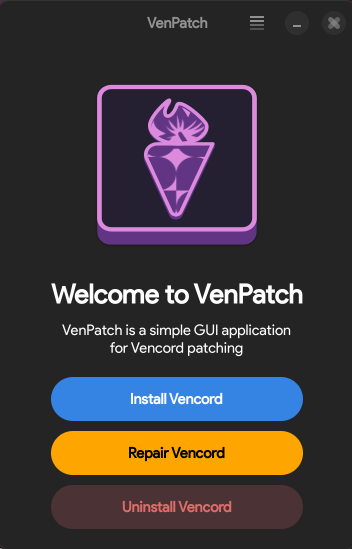

# VenPatch

 

A simple GUI wrapper for the ever beloved Vencord installer.

Vencord for Linux, as opposed to its MacOS and Windows variants, still relies on a command line for its installation/repair which, while not bad, gets annoying fast whenever Discord needs to update and Vencord requires an Installation Repair.

This simple GUI solution installs as a flatpak and makes this routine procedure, or even just installing Vencord, as simple as pointing and clicking.

Much like the official installer, VenPatch also supports custom paths for your Discord installation.

The app supports:

- Installing Vencord
- Repairing the existing Vencord Installation
- Uninstalling Vencord

VenPatch currently doesn't support OpenASAR.

I hope you love this app as much as I did while making it <3

## Install

Being a flatpak app, you will first need to [setup flatpak](https://flathub.org/setup) on your system, which may vary depending on your distro.

Once you have flatpak all set up you can either install it via your distro's utility (e.g. GNOME Software with Flathub plugin) or, if you prefer, run:

`flatpak install --user io.github.pinkavocadodev.venpatch.flatpak`
`flatpak run io.github.pinkavocadodev.venpatch`

## Compiling from source

VenPatch is a standard flatpak application developed using PyGObject with GTK 4 and Libadwaita, in order to compile it from source you will need to run:

`flatpak build-bundle YOUR/REPO/PATH io.github.pinkavocadodev.venpatch.flatpak io.github.pinkavocadodev.venpatch`
